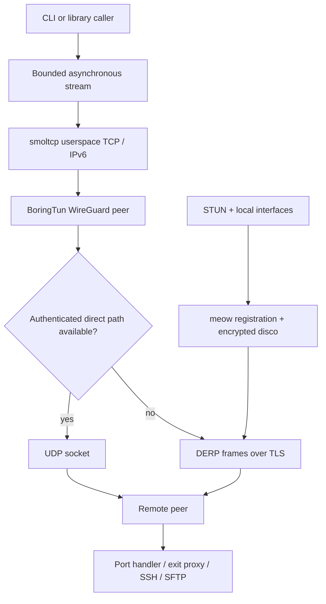

# Repository map

`tailcat-rs` implements a capability-addressed, control-plane-free network in
Rust. Every client or server owns its keys, relay connection, WireGuard peers,
and userspace TCP stack. It does not change host routes, DNS settings, or TUN
devices. The native crate and executable retain the name `tailcat`.

The protocol and application behavior originate in
[tailscale/tailcat](https://github.com/tailscale/tailcat). This standalone source
was extracted from the independent Rust port in
[spullara/tailcat at `689b74e2405c18fbdf4b21a0610d8c1abae8f334`](https://github.com/spullara/tailcat/tree/689b74e2405c18fbdf4b21a0610d8c1abae8f334).
That external snapshot supplies the optional Go compatibility tests. This
repository contains no Go source or imported Go commit history.

## Source map

| Module | Responsibility |
|---|---|
| [src/lib.rs](../src/lib.rs) | Public modules and client/server type exports |
| [src/runtime.rs](../src/runtime.rs) | Native actor, lifecycle, bounded streams, WireGuard, smoltcp, STUN/disco, direct paths, status snapshots |
| [src/protocol.rs](../src/protocol.rs) | Key derivation, address serialization, DERP metadata, region selection, persistent map cache, NAT64 addressing |
| [src/derp.rs](../src/derp.rs) | TLS/HTTP upgrade, DERP authentication and frames, reconnecting relay transport, local test relay |
| [src/bin/tailcat.rs](../src/bin/tailcat.rs), [src/cli/mod.rs](../src/cli/mod.rs) | Executable entry and command dispatch |
| [src/cli/args.rs](../src/cli/args.rs), [src/cli/util.rs](../src/cli/util.rs) | Flag parsing, help, validation, address classification, subprocess quoting |
| [src/cli/keys.rs](../src/cli/keys.rs) | Saved identities, generation, permissions, default key selection |
| [src/cli/clients.rs](../src/cli/clients.rs) | Pipe, ping, SOCKS, forwarding, SSH/scp, native SFTP listing |
| [src/cli/serving.rs](../src/cli/serving.rs) | Service selection, port handlers, receiver, client allowlists |
| [src/services/mod.rs](../src/services/mod.rs) | SSH session channels, host identity, SFTP dispatch, listing client |
| [src/services/shell.rs](../src/services/shell.rs) | Unix/Windows shell processes, PTY, resize, signals, output and exit handling |
| [src/services/files.rs](../src/services/files.rs) | Rooted capability filesystem and SFTP access policies |
| [wasm/src/lib.rs](../wasm/src/lib.rs) | Browser networking API, WebSocket DERP, WireGuard/TCP lifecycle and JS bindings |
| [web/app.js](../web/app.js), [web/index.html](../web/index.html) | Browser DOM, file selection, transfer streams, UI; intentional JavaScript/HTML source |
| [src/webdemo.rs](../src/webdemo.rs), [src/bin/tailcat-webdist.rs](../src/bin/tailcat-webdist.rs), [src/bin/tailcat-web.rs](../src/bin/tailcat-web.rs) | Rust/WASM distribution build, compression and local HTTP serving |
| [third_party/boringtun](../third_party/boringtun/) | Browser-compatible BoringTun with documented clock/entropy adaptation |
| [examples](../examples/) | Compilable library server/client examples |
| [Makefile](../Makefile), [.github/workflows](../.github/workflows/), [scripts](../scripts/) | Rust checks, packaging, optional external interoperability and releases |

Native builds use upstream BoringTun from crates.io. Browser builds use the
vendored adaptation. The browser page directly initializes the generated
wasm-bindgen module; there is no Go runtime or Go-to-JavaScript bootstrap.
The web builder copies the JavaScript and HTML source and emits Rust bindings
and compressed WASM assets.

## Layers and data flow



The native runtime uses one actor per client or server. That actor exclusively
owns its smoltcp interface, sockets, peer tunnels, discovery state, and pending
operations. Callers communicate through bounded channels. An accepted or dialed
TCP connection becomes a Tokio duplex stream, so service code can use ordinary
`AsyncRead`/`AsyncWrite` without accessing packet internals. Each server can
accept multiple clients and multiple TCP connections per client.

`Client::status()` and `Server::status()` return actor-owned snapshots of peer
handshakes, traffic counters, direct endpoints, and active TCP connections.
Packet headers and checksums are validated before allocating TCP buffers.
Each actor caps TCP connections at 256, learned endpoints per peer at 32, and
outstanding pings at 128; cancellation releases pending operations.

A separate DERP task owns the TLS stream and reconnects to nodes in the selected
region. Its public datagram channels remain stable across reconnects. Packet
loss at a full relay queue is handled by TCP and WireGuard retransmission, rather
than blocking the packet-processing actor indefinitely.

## Protocol contract

1. A node private key is a clamped 32-byte Curve25519 scalar. The disco private
   key is HMAC-SHA256 keyed by those bytes over the exact string
   `github.com/tailscale/tailcat disco key v1`, then clamped. Exposing a disco
   public key must not expose the node public key that grants access.
2. An address is `tc` followed by unpadded URL-safe base64 of CBOR. Top-level
   keys are `p` (node key), `k` (disco key), `r` (embedded regions), and `i`
   (region ID). Both keys are CBOR byte strings, not strings or integer arrays.
   Encoding omits redundant region IDs/names; parsing reconstructs them.
   The address vocabulary is deliberately independent of upstream DERP structs.
3. A DERP frame is one type byte plus a big-endian 32-bit payload length. The
   TLS HTTP upgrade is followed by the DERP v2 NaCl-box authentication exchange.
   Peer keys supplied by DERP identify the packet's authenticated sender.
4. A meow ping is `meow`, type `1`, 32-byte node key, 32-byte disco key. The
   server checks the DERP sender against the claimed node key and its allowlist
   before adding a WireGuard peer. Its acknowledgement is `meow`, type `2`.
   Zero discovery keys and malformed input are rejected. Meow messages retry
   because a relay can drop traffic while the other peer is connecting.
5. Each peer's internal IPv6 address is `fd7a:115c:a1e0::/48` plus the first
   80 bits of its node public key. Server-side decrypted source validation
   prevents one registered client impersonating another's internal IP.
6. Direct discovery packets use the Tailscale `TS💬` magic, the sender's disco
   public key, a 24-byte nonce, and an authenticated XSalsa20Poly1305 box.
   Call-me-maybe advertises endpoints through DERP; ping/pong transactions
   verify bidirectional UDP reachability. The runtime handles IPv4 and IPv6
   UDP paths, refreshes candidate probes, and falls back to DERP when a direct
   path expires. This is a focused implementation of the protocols tailcat
   uses, not a port of every upstream magicsock feature.
7. Exit-node TCP targets use IPv6 in the tunnel. IPv4 destinations are encoded
   under `64:ff9b::/96` and converted back before the server's host TCP dial.
8. TCP EOF is directional. After application EOF, send FIN while continuing
   to receive the response. Drain FIN/ACK work before dropping the userspace
   stack; otherwise a successful-looking process exit can truncate traffic or
   leave the remote process waiting.

## Services

The CLI preserves the Tailcat command surface: default pipe mode, `serve`,
`recv`, `ping`, `socks`, `forward`, `ssh`, `cp`, `ls`, `parse`, `resolve`,
`genkey`, `printpub`, `version`, and `readme`. Flags stop at the first positional
argument so child command flags pass through unchanged. Saved keys preserve
the reference implementation's JSON/key encodings and default/client-default selection conventions.

`ssh` and `cp` invoke the system OpenSSH executables with a tailcat
ProxyCommand; shell metacharacters and OpenSSH `%` expansion are quoted.
The destination label is a stable short hash rather than the secret address.
CLI address arguments containing tailcat-like addresses embedded in dotted
names are rejected before DNS queries.
`ls` uses the Rust SSH/SFTP client directly. `forward` and SOCKS bind to loopback
by default; exit-node destinations are explicit IP addresses or locally resolved
hostnames, while `server.tailcat` selects the server itself.

The built-in SSH server accepts session channels, runs as the current OS user,
and has no separate user authentication. Shell access and file access are
independent capabilities. Only TERM, LANG, and LC_* environment variables are
accepted from the client. Non-PTY stdout and stderr stay separate; PTYs preserve
terminal size and control-character behavior. SSH exit status is sent after
output is drained, including successful SFTP/scp sessions.

File modes are enforced by capability-relative filesystem operations (`cap-std`),
not string-prefix checks or canonicalize-then-open sequences:

| Mode | Read/list | Create | Existing files | Directories | Mutating metadata |
|---|---|---|---|---|---|
| `ro` | yes | no | read only | list only | no |
| `rw` | yes | yes | ordinary SFTP flags | yes | yes; ownership ignored |
| `wo` | no | server-randomized root-level names | never replaced | no | session-created files only |
| `wo+` | no | requested name or randomized collision sibling | never replaced | yes | session-created files only |

Write-only requests use exclusive creation and session-local requested-name
mappings. A guessed existing filename cannot be used to read, overwrite, or
probe an unrelated file. Symlinks cannot escape a rooted share. Shell mode with
no explicit file share intentionally grants the current user's ordinary
filesystem access, matching the access granted by its shell.

## Verification

Normal development checks need Rust, a native C toolchain, and the platform
utilities exercised by a test (for example OpenSSH for its integration test):

```sh
cargo test --locked --all-targets
cargo fmt --all -- --check
cargo clippy --locked --all-targets -- -D warnings
```

Rust tests cover address vectors, authenticated frames, malformed inputs,
key permissions, CLI quoting and DNS rules, a local TLS DERP relay,
multi-megabyte transfers, direct discovery, client allowlists, PTYs, OpenSSH,
all four file modes, and symlink confinement. Targeted runtime tests cover
invalid SYN allocation, pending-flow deduplication, endpoint/ping bounds,
relay backpressure, authenticated endpoint promotion, and unread TCP data
surviving a completed close handshake. Binaries and examples are also compiled.

### Optional external interoperability

[scripts/check-interop.py](../scripts/check-interop.py) fetches the pinned
[reference snapshot](https://github.com/spullara/tailcat/tree/689b74e2405c18fbdf4b21a0610d8c1abae8f334)
into a temporary directory. It does not copy Go sources into this repository.
It requires Python 3, Git, Go 1.27, and network access to fetch the reference
and its dependencies; traffic tests themselves use a local DERP relay.

```sh
make interop       # Focused wire tests, including both CLI pairings
make interop-full  # Reference CLI behavior suite against the Rust executable
make interop-web   # Build Rust browser assets and run external browser tests
```

Or select a binary and browser distribution directly:

```sh
python3 scripts/check-interop.py --binary target/release/tailcat --full-cli
python3 scripts/check-interop.py --binary target/release/tailcat --web-dist dist
```

The reference tests pair the Rust CLI with the Go library in both directions
and run both executable pairings. They transfer multi-megabyte binary data
with normal path selection and with UDP disabled on the Go peer to require
DERP. A response prefix arrives before request EOF and the remainder follows
it, exercising bidirectional delivery and half-close. Separate
`ping --until-direct` cases verify direct UDP discovery; they do not assert
that every bulk-transfer packet used UDP.

The full CLI suite covers pipes, ping, port serving, exit nodes, SOCKS,
forwarding, SSH, copying, receiving, and listing. It runs against the supplied
Rust executable through the reference test harness's `TAILCAT_TEST_BINARY`
setting. The browser option points that harness's `TAILCAT_WEB_DIST` at a
Rust-built distribution and additionally requires Chrome/Chromium. Its tests
exercise browser-to-native and native-to-browser transfers, plus a regression
for stale connection handles across listener closure and relay reconnection.
Browsers relay through WebSockets because native UDP is unavailable.

The Test workflow runs native Rust checks and the browser build. External
interoperability has a separate manually dispatched workflow. OS-specific CI
execution is separate evidence from a macOS run; cross-compilation alone does
not validate runtime behavior on a different operating system.

### Historical validation of the port

These results were recorded on macOS on 2026-09-03 in the original mixed
Go/Rust checkout, **before standalone extraction**. They describe the port's
prior evidence, not a test run or release of this new repository. Standalone
validation should use the commands above and the new repository's workflow
results.

| Check in the original checkout | Recorded result |
|---|---|
| `cargo test --locked --all-targets` | 52 tests passed; binaries and examples compiled |
| Native and wasm32 Clippy with `-D warnings` | Passed; upstream BoringTun dependency warnings remained in the browser build |
| Optimized native binaries | Built successfully |
| Reference Go CLI suite against optimized Rust | Passed, including both mixed-language transfer directions |
| Go/Rust executable matrix | Six cases passed: both CLI pairings, 2 MiB transfers, forced relay, direct discovery |
| Original Go reference tests | Passed in the external reference source |
| Headless Chrome suite against Rust-built assets | All five tests passed |
| Default public DERP bootstrap and pipe transfer | Passed at that time |
| Workflow lint, archive/ZIP contents, whitespace checks | Passed for the original checkout |
| Linux/Windows execution, Nix, Docker | Not run locally during that validation |

### Standalone extraction validation

The standalone checkout was also checked on macOS on 2026-09-03:

| Check | Result |
|---|---|
| Native Rust tests, binaries, and examples | All 52 tests passed |
| Native and wasm32 formatting/Clippy | Passed; existing upstream browser dependency warnings remain |
| Optimized native binaries and Rust browser distribution | Built successfully |
| Full external CLI suite using this checkout's Rust executable | Passed, including both Go/Rust executable pairings |
| External Chrome tests using this checkout's browser assets | All five passed |
| Native `serve files` followed by `ls` | Verified the default current-directory share |
| Workflow lint and archive/ZIP contents | Passed |

The external test runner fetched the pinned reference into a temporary directory
and removed it afterward. Linux/Windows execution, Docker, and Nix remain checks
for their respective environments.
